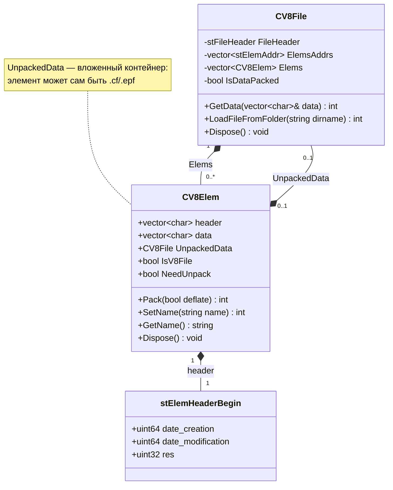
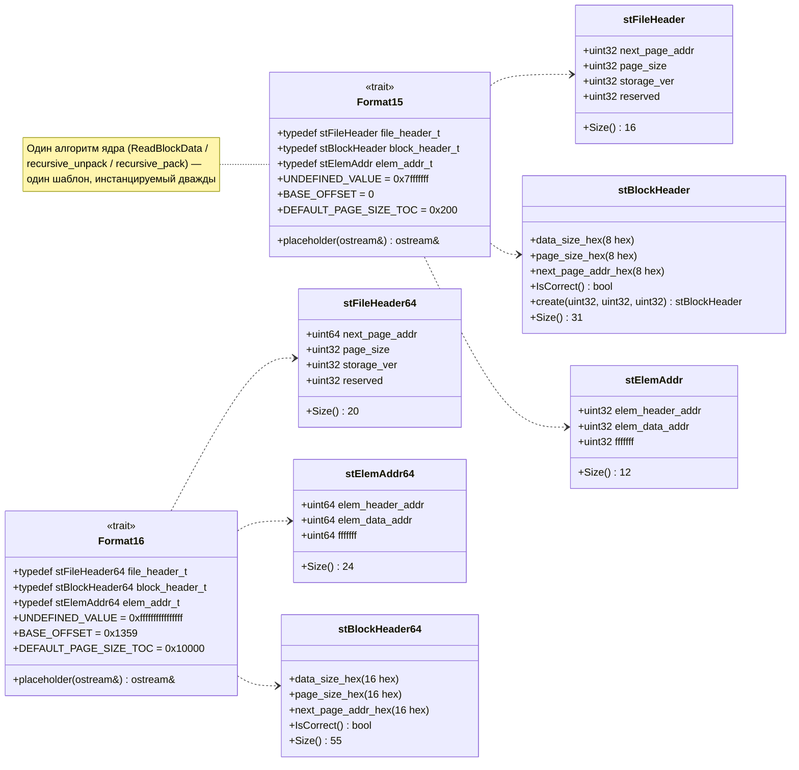
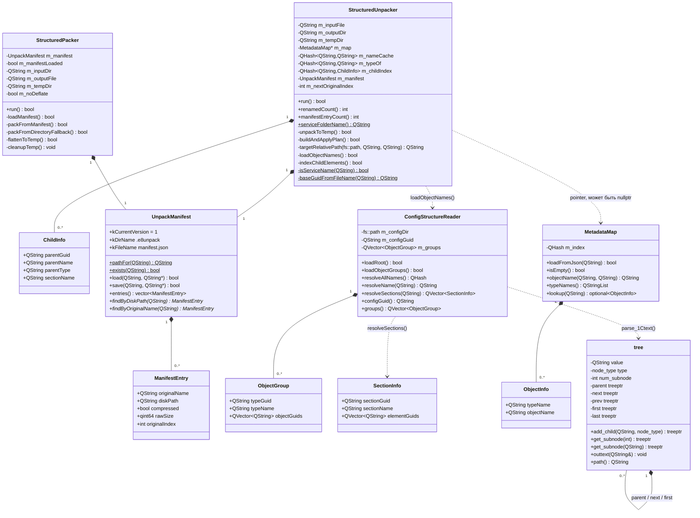
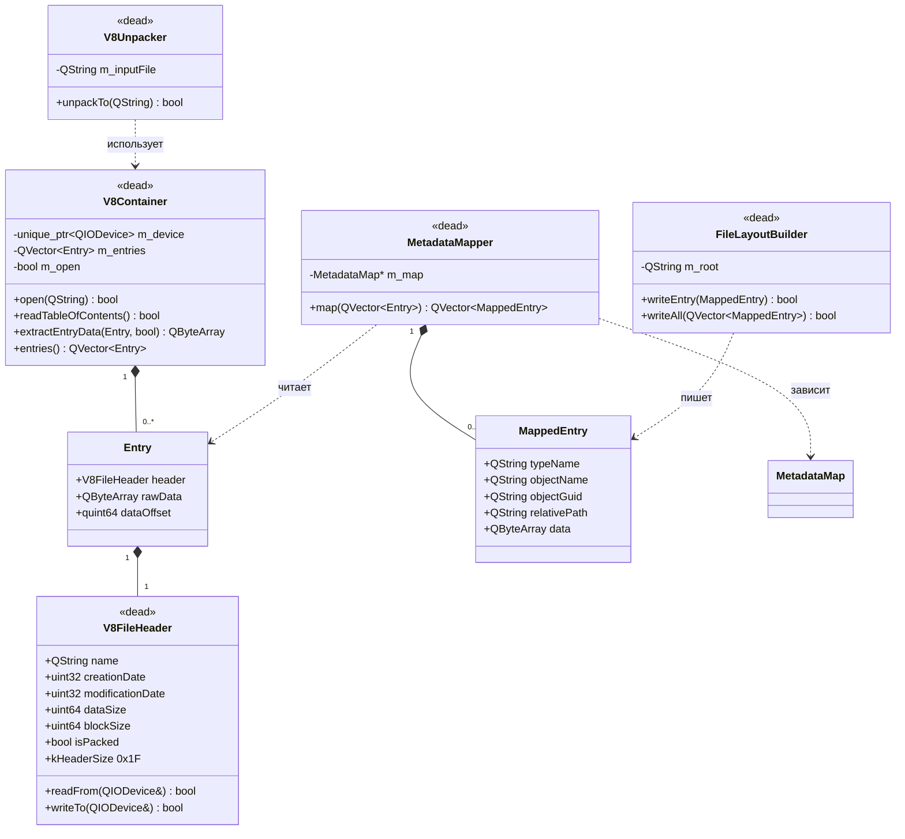
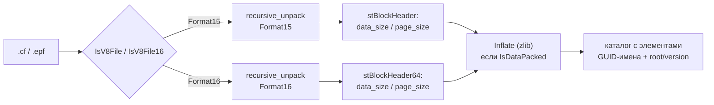
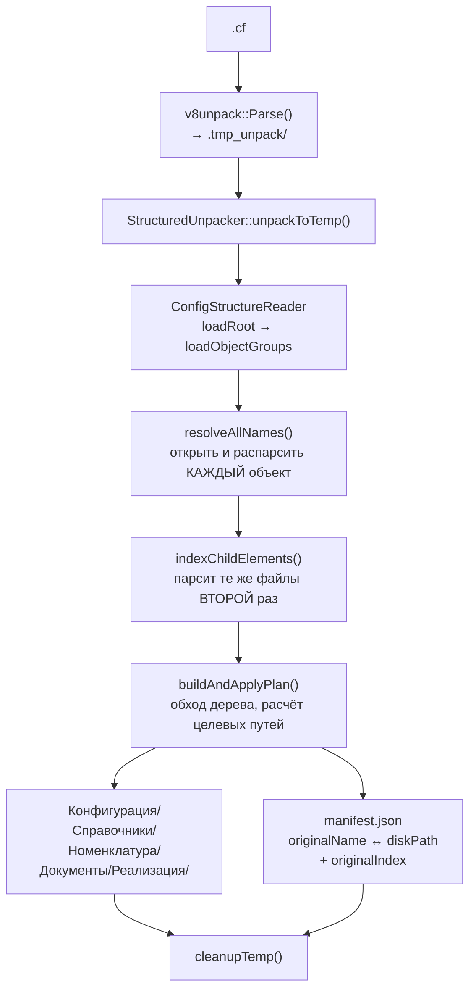
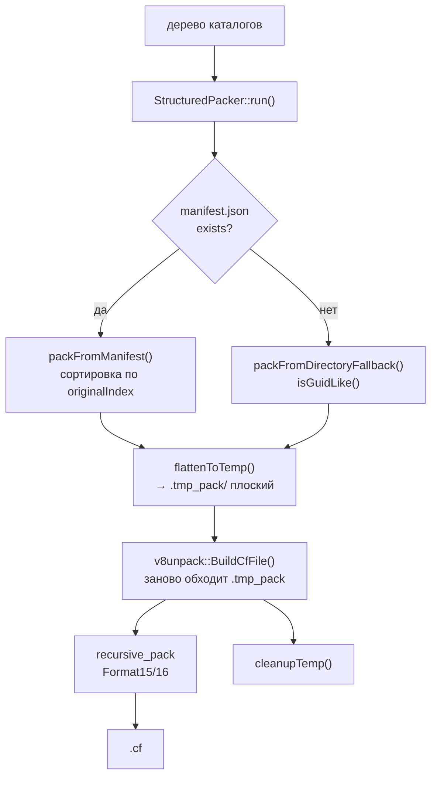

# v8Unpack — архитектура и устройство проекта

```
        __  _____  __  __  __   __        __   __
  _   _/ / / __ \/ / / / / /  / /  ___   / /__/ /_
 | | /| / / / / / / / / / /__/ _ \/ _ \ / __/ __/ __/
 | |/ |/ / /_/ / /_/ / /____/ // / // // /_/ /_/ /_
 |__/|__/\___/\____/_______/____/\___/ \__/\__/\__/
```

Утилита командной строки для **разбора и сборки контейнеров 1С:Предприятие 8**.

Поддерживаемые форматы: `.cf` (конфигурация), `.cfe` (расширение), `.epf` (внешняя обработка),
`.erf` (внешний отчёт), `.data` (сжатые блоки).

Исторически — форк **v8Unpack Дениса Демидова**; поверх старого ядра на `std::stream` + Boost
пристроен слой на Qt6, который переименовывает элементы контейнера в человекочитаемые пути
через `manifest.json` (режимы `-DE` / `-CO`).

---

## Карточка проекта

| Параметр | Значение |
|---|---|
| Версия | 3.0.43 |
| Лицензия | MPL-2.0 (Mozilla Public License 2.0) |
| Язык | C++ (фактически C++17, объявлен C++14 — см. «Известные расхождения») |
| Объём | 18 `.cpp` + 19 `.h`, ≈ 6400 строк (без вендоренного zlib) |
| Самый крупный файл | `src/V8File.cpp` — ≈ 1350 строк |
| Сборка | CMake ≥ 3.10 (основная), Makefile — устаревший сгенератор, нерабочий |
| Зависимости | Qt6 Core, Boost 1.53+ (filesystem, system, iostreams), zlib |
| Линковка Boost | статическая по умолчанию (`USE_STATIC_BOOST=ON`) |
| Платформы | Windows (MSVC 2022 x64), Linux (GCC) |
| Тесты | `test/run.sh` — 3 сценария round-trip, в CI не подключены |

---

## Структура репозитория

```
e8unpack/
├── CMakeLists.txt            основная сборка (единственная рабочая)
├── Makefile                  ⚠ устарел: 5 .cpp из 18, без Qt/Boost.Iostreams
├── README.md
├── LICENSE                   MPL-2.0
├── VersionInfo.rc            ресурсы версии для Windows
├── appveyor.yml              CI: VS2015 / Ubuntu 16.04 / Boost 1.60 — устарел, Qt6 не ставит
├── bash_completion.sh
├── v8unpack.nuspec, v8unpack.wxs, choco/    упаковка Windows (NuGet/Chocolatey/MSI)
├── debian/, rpm/             упаковка Linux (собирают пустые пакеты — нет install())
├── docs/
│   └── REFACTORING.md        ⭐ аудит на 379 строк: дефекты, замеры, план рефакторинга
├── test/
│   └── run.sh                round-trip тесты (build→parse, unpack→pack→parse)
├── .vscode/launch.json
└── src/
    ├── main.cpp              482  CLI: диспетчер режимов, разбор аргументов
    ├── V8File.cpp/.h        1352/405  ⭐ ЯДРО: формат контейнера, чтение/запись/сжатие
    ├── utils.cpp             453  deflate/inflate (zlib), работа с буферами
    ├── VersionFile.cpp/.h     53/35  определение версии/совместимости контейнера
    ├── placeholder216.cpp    333  фиктивный загрузчик смещения 0x1359 (Format16)
    ├── version.h               9  версия продукта
    ├── zlib.h, zconf.h      1357/332  ⚠ вендоренный zlib 1.2.3 (2005) — перекрывает системный
    ├── core/                 475  ⚠ мёртвый Qt-каркас (в сборке, недостижим)
    │   ├── MetadataTypes.h/.cpp      таблицы GUID↔имя типов метаданных 1С
    │   ├── V8FileHeader.h/.cpp       «заголовок элемента» (модель не соответствует формату)
    │   ├── V8Container.h/.cpp        «контейнер» (упрощённая неверная модель)
    │   └── V8Unpacker.h/.cpp         фасад-заглушка
    ├── parser/               809  разбор текстового формата 1С
    │   ├── NodeTypes.h               enum node_type — типы узлов дерева
    │   └── Parse_tree.h/.cpp         дерево tree + parse_1Ctext/parse_1Cstream
    ├── metadata/             785  слой метаданных
    │   ├── ConfigStructureReader.*   чтение иерархии конфигурации из файлов root/структуры
    │   ├── MetadataMap.*             карта GUID→имя из внешнего JSON (std::optional)
    │   ├── MetadataMapper.*          ⚠ мёртвый: маппинг записей контейнера на метаданные
    │   └── SectionTypes.*            GUID↔имя секций (Формы, Реквизиты, Макеты…)
    └── output/              1209  раскладка по каталогам и обратная сборка
        ├── StructuredUnpacker.*      контейнер → человекочитаемое дерево каталогов
        ├── StructuredPacker.*        дерево каталогов → контейнер
        ├── UnpackManifest.*          manifest.json: originalName ↔ diskPath + порядок
        └── FileLayoutBuilder.*       ⚠ мёртвый: запись MappedEntry на диск
```

---

## Архитектура: три слоя

Проект вырос послойно, и это видно в коде. Слои сосуществуют в одном бинарнике:

| Слой | Технология | Файлы | Состояние |
|---|---|---|---|
| **1. Ядро контейнера** | `std::stream`, Boost.Filesystem, zlib | `V8File.*`, `utils.cpp`, `placeholder216.cpp`, `VersionFile.*` | ✅ работает, round-trip побайтово точен |
| **2. Метаданные и вывод** | Qt6 (`QString`/`QByteArray`/`QJson`) | `parser/`, `metadata/`, `output/` | ⚠ частично: раскладка работает, порядок элементов — нет |
| **3. Qt-каркас** | Qt6 | `core/V8Container`, `core/V8FileHeader`, `core/V8Unpacker`, `MetadataMapper`, `FileLayoutBuilder` | ❌ мёртвый код: компилируется, но недостижим из CLI |

Слои общаются через `std::string` (тракт как UTF-8) — это источник дефектов с кириллицей
на Windows, где Boost декодирует узкие пути как `CP_ACP`.

---

## Диаграмма классов

### Ядро контейнера (живое)



### Формат контейнера: структуры и traits



### Слой метаданных и вывода (живой)



### Мёртвый Qt-каркас (в бинарнике, но недостижим)



> ⚠ **Почему это опасно держать.** `V8FileHeader::kHeaderSize = 0x1F` — это размер
> *блочного* заголовка (`stBlockHeader::Size()`), а не little-endian-структуры. Каркас читает
> hex-текст как бинарные поля, «имя» извлекает из ASCII-цифр (`"c00 0000"`), таблица
> содержимого состоит из одной записи, а распаковка использует zlib-обёртку там, где 1С пишет
> raw deflate. Следующий разработчик, которому понадобится «доступ к контейнеру», подключит
> именно его.

---

## Потоки данных

### `-UNPACK` — контейнер → плоский каталог



### `-DE[COMPILE]` — контейнер → человекочитаемое дерево



### `-CO[MPILE]` — человекочитаемое дерево → контейнер



> ⚠ Сортировка по `originalIndex` **не даёт эффекта**: `BuildCfFile` заново перечисляет
> каталог и пишет элементы в порядке обхода ФС, а не в порядке копирования. Подробности —
> `docs/REFACTORING.md` §3.8.

---

## Формат контейнера

Контейнер — это **дерево элементов**. Каждый элемент либо файл, либо вложенный контейнер
(`CV8Elem::UnpackedData` — это `CV8File`).

Читается постранично, страницами по 512 байт, с цепочкой адресов:

1. **`stFileHeader`** — первый заголовок файла: `next_page_addr`, `page_size`, `storage_ver`.
2. **Таблица содержимого (TOC)** — массив `stElemAddr` (`elem_header_addr`, `elem_data_addr`).
3. **`stBlockHeader`** — заголовок каждого блока в виде **hex-текста ASCII**:
   `\r<br/>[data_size 8 hex] [page_size 8 hex] [next_page_addr 8 hex]\r<br/>` — итого 31 байт.
   В 64-битном варианте поля по 16 символов, заголовок 55 байт.
   Отсюда `_httoi` / `_itoht` — парсинг и генерация hex в текст.
4. Данные блока: при `IsDataPacked` — raw deflate (`zlib`), иначе как есть.

Два формата различаются типом адресов и смещением, различия описаны traits-структурами
`Format15` / `Format16`; сам алгоритм — один шаблон, инстанцируемый дважды. Это сильная
сторона проекта: `ReadBlockData`, `recursive_unpack`, `recursive_pack`, `pack_from_folder`
написаны один раз.

`Format16::BASE_OFFSET = 0x1359` — «магическое» смещение; за его наличие при сборке отвечает
`src/placeholder216.cpp` (333 байта заглушки).

---

## CLI

Точка входа — `src/main.cpp`. Диспетчер устроен так:

```
get_run_mode(args) → handler_t (указатель на функцию) + arg_base + allow_listfile
get_run_mode →  if-цепочка по argv[0]
required_args_for(handler) → арность режима (литералы, ключ — адрес функции)
```

| Режим | Действие |
|---|---|
| `-UNPACK` | распаковать `.cf` в каталог (или список) |
| `-PACK` | собрать `.cf` из каталога (или список) |
| `-INFLATE` | распаковать `.data` → файл |
| `-DEFLATE` | сжать файл → `.data` |
| `-PARSE` | `-UNPACK` без сжатия: `.cf` → дерево элементов |
| `-BUILD` | `-PACK` без сжатия |
| `-BUILD -NOPACK` | сборка без компрессии и без промежуточных файлов |
| `-DE[COMPILE]` | распаковка + раскладка по метаданным + `manifest.json` |
| `-CO[MPILE]` | сборка из разложенного дерева |
| `-LIST` | пакетный режим: выполнить список операций из файла |
| `-LISTFILES` | показать элементы контейнера |
| `-VERSION` | версия |

Три параллельные структуры описывают одно и то же (forward-объявления, `if`-цепочка,
таблица арности) — кандидат на объединение в единый массив `{token, handler, min_args, …}`.

---

## Сборка

```bash
# Зависимости (Ubuntu 24.04)
sudo apt-get install -y build-essential cmake ninja-build \
    qt6-base-dev libboost-all-dev zlib1g-dev \
    libbz2-dev liblzma-dev libzstd-dev

# Конфигурация и сборка
cmake -S . -B build -G Ninja -DCMAKE_BUILD_TYPE=Release -DCMAKE_EXPORT_COMPILE_COMMANDS=ON
cmake --build build -j2

# Проверка
bash test/run.sh ./build/v8unpack
```

**Почему нужны `libbz2-dev`, `liblzma-dev`, `libzstd-dev`:** Boost линкуется статически
(`USE_STATIC_BOOST=ON`), а `libboost_iostreams.a` тянет за собой bzip2, lzma и zstd. Без
dev-пакетов линковка падает с `cannot find -lbz2 / -llzma / -lzstd`, хотя сами библиотеки
в системе есть (только runtime).

Полезные опции CMake: `-DUSE_STATIC_BOOST=OFF` (динамический Boost),
`-DBoost_ROOT=…` / `-DBOOST_ROOT=…`, `-DBoost_COMPILER=-vc142` (для MSVC).

---

## Состояние кода

### ✅ Что работает и проверено

- **Round-trip побайтово точен.** `build → parse`, `unpack → pack → parse`,
  `-DE → -CO → parse` дают идентичные файлы; пересобранный `.cf` совпадает с исходным
  побайтово (проверено на 5000 файлов / 145 МБ).
- **`test/run.sh` проходит все 3 сценария** на нашей сборке.
- **Ядро сжатия** (`utils.cpp`, zlib) работает; потоковая обработка крупных элементов
  (≥ `SmartUnpackedLimit`) существует.

### ⚠ Известные дефекты (выжимка из `docs/REFACTORING.md`)

Критичные — подробности и точные номера строк в исходном документе:

- **П1** `utils.cpp`: `if (!out_buf)` проверяет `char**`, а не результат `realloc` → потеря
  памяти и `memcpy` в NULL; в ветке ошибки вызывается `deflateEnd` для inflate-потока.
- **П2** `V8File.cpp`: `GetName` считает `(header.size() - 20) / 2` без проверки длины →
  переполнение разности на коротком заголовке.
- **П3–П4** `V8File.cpp`: два независимых бесконечных цикла (`page_size == 0`, нулевой
  прогресс) и отсутствие проверки `next_page_addr` → зависание на повреждённом файле.
- **П5** `V8File.cpp`: `resize(data_size)` из недоверенного поля заголовка без клампа →
  100-байтный файл требует гигабайтной аллокации.
- **М1** `StructuredPacker.cpp`: ошибка копирования элемента понижается до `qWarning` +
  `continue` → `.cf` собирается **без** части элементов, возвращается код 0.
- **М7** Во всём `src/` нет ни одного `try`/`catch`, при этом используются бросающие
  перегрузки Boost → падение без диагностики вместо кода ошибки.
- **М8** `QT_NO_DEBUG_OUTPUT` не определён → в Release остаются `qDebug` на каждый
  разобранный файл (>20 000 строк лога на крупную конфигурацию).

### 🐌 Производительность (замеры из REFACTORING.md, 5000 файлов / 145 МБ)

| Режим | Время |
|---|---|
| `-build -nopack` | 613 мс |
| `-unpack` (потоково) | 259 мс |
| `-build` (со сжатием) | 3286 мс |
| `-parse` (сжатый) | 2523 мс |
| `-compile` | 5273 мс |
| `-listfiles` | 18 мс |

Сжатие — **81 % времени** `-build` (2670 мс из 3286). `SmartLimit` в `V8File.cpp:400`
объявлен как `00 * 1024` == 0, из-за чего условие `data_size < SmartLimit` не выполняется
никогда: **каждый** элемент, включая 100-байтные, идёт через временные файлы
`.v8unpack.tmp`/`.v8unpack.inf`. Это главная точка оптимизации.

### 📌 Известные расхождения в описании

Документация и код расходятся — это стоит знать, чтобы не искать ошибку там, где её нет:

| Заявлено | Фактически |
|---|---|
| `CMAKE_CXX_STANDARD 14` | собирается как **C++17**, потому что `Qt6::Core` экспортирует `cxx_std_17` и CMake поднимает стандарт |
| `Makefile` — альтернативная сборка | собирает 5 `.cpp` из 18, без Qt6 и Boost.Iostreams — `make` не работает вовсе |
| CI зелёный | `appveyor.yml` закреплён на VS2015 / Ubuntu 16.04 / Boost 1.60 и не ставит Qt6 |
| Два zlib | `src/zlib.h` версии 1.2.3 (2005) стоит в include-путях раньше системного `Zlib 1.3` |
| Коды ошибок уникальны | `V8UNPACK_NOT_V8_FILE` и `V8UNPACK_DEFLATE_IN_FILE_NOT_FOUND` оба `-51`; ещё одна коллизия на `-52` |

`docs/REFACTORING.md` содержит полный план из 5 этапов с приоритетами P0–P3 и правилом
приёмки: **побайтовый round-trip на 5000 файлах сохраняется, время не ухудшается, `ctest`
зелёный, новые ошибки обрабатываются кодом возврата, а не падением.**

---

## Быстрый старт для разработчика

```bash
# 1. Собрать
cmake -S . -B build -G Ninja -DCMAKE_BUILD_TYPE=Release -DCMAKE_EXPORT_COMPILE_COMMANDS=ON
cmake --build build -j2

# 2. Симлинк для clangd (автодополнение и переходы)
ln -sf build/compile_commands.json compile_commands.json

# 3. Проверить round-trip
bash test/run.sh ./build/v8unpack

# 4. Разобрать реальную конфигурацию
./build/v8unpack -DE 1c.cf out/          # контейнер → человекочитаемое дерево
./build/v8unpack -CO out/ repacked.cf    # дерево → контейнер
```

`-DE` — самый полезный режим для изучения формы: он даёт человекочитаемые имена вместо
GUID и кладёт рядом `manifest.json` с обратным отображением.

---

*Документ составлен по чтению исходников, сборке и запуску тестов на Ubuntu 24.04 /
GCC 13.3. Числовые замеры производительности взяты из `docs/REFACTORING.md` (Windows MSVC
build) и помечены там как `[измерено]`.*